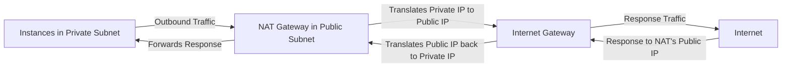
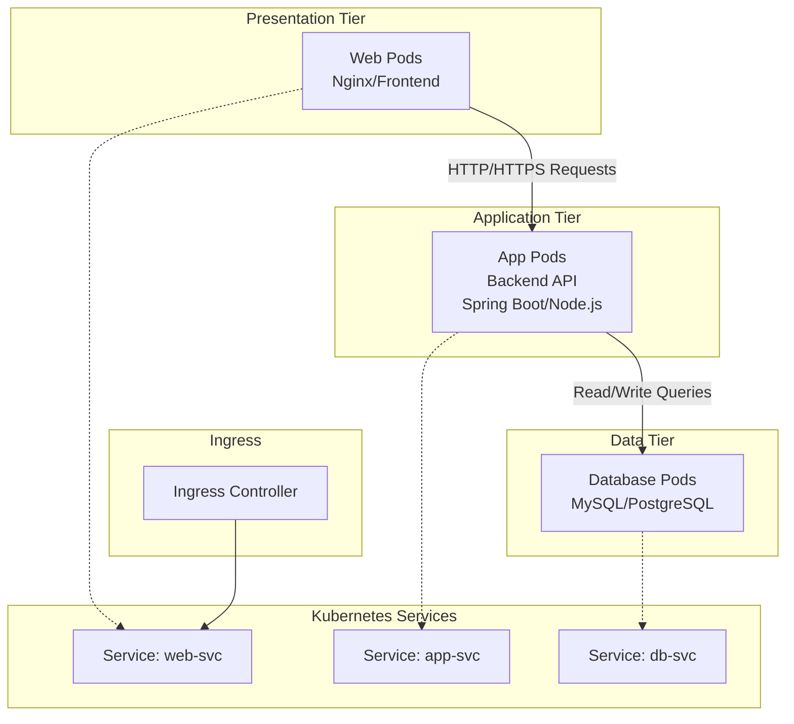
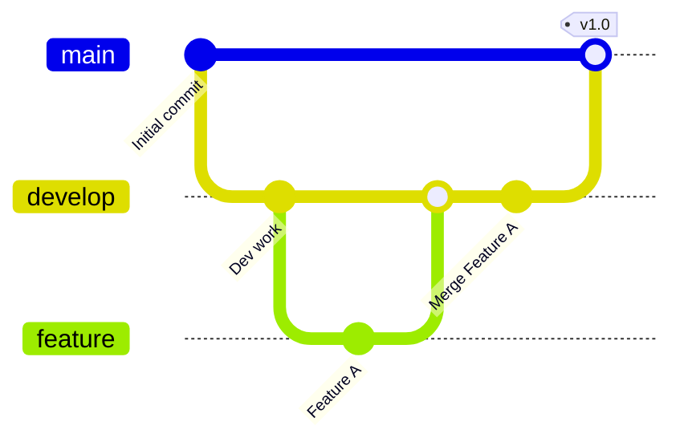
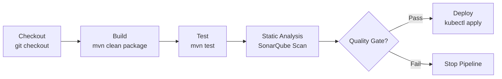
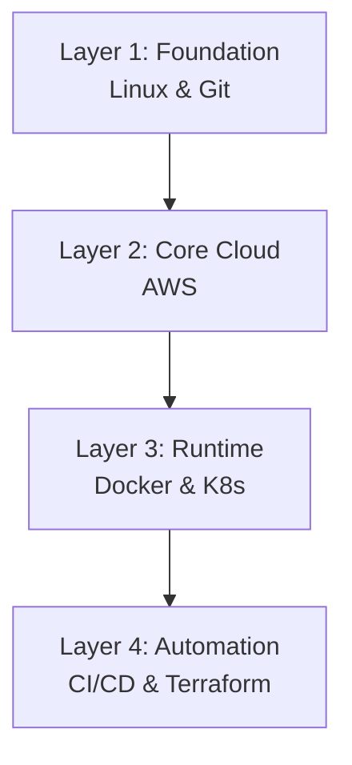

## 🖥️ 1. Linux & Operating System

### **How do you find files modified two days ago in Linux?**
```bash
find /path/to/search -mtime -2 -ls
```
**Explanation**: The `find` command with `-mtime -2` locates files modified less than 2 days ago. Adding `-ls` displays detailed file information. For exactly 2 days ago, use `-mtime 2`. You can also combine with `-name` to filter specific file types.

### **What is the sudoers file? What is its purpose?**
The **sudoers file** (`/etc/sudoers`) controls which users can run commands with `sudo` privileges. It defines **permission rules** for delegating administrative tasks without sharing root passwords. Always edit it using `visudo` (which validates syntax) to prevent locking yourself out.

### **What is a zombie process?**
A **zombie process** is a child process that has completed execution but still has an entry in the process table. Its parent hasn't read its exit code yet, so the process remains "undead." While they don't consume CPU, too many can fill the process table and prevent new processes from starting 【turn0search1】. To clean them, identify and fix the parent process (often by killing or restarting it) or reboot the system.

### **Short Linux Questions:**
| Topic | Commands & Concepts |
| :--- | :--- |
| **Permissions** | `chmod 755 file` (rwx for owner, rx for group/others); `chown user:group file` |
| **Process Management** | `ps aux` (list processes), `top` (real-time monitoring), `kill PID` (terminate process) |
| **Networking** | `ip addr` (show IP addresses), `netstat -tuln` (list listening ports), `ssh user@host` (remote login) |
| **Disk Usage** | `df -h` (disk space), `du -sh directory` (directory size) |

---

## ☁️ 2. AWS (Amazon Web Services)

### **How do you allow HTTP and HTTPS access to an EC2 instance?**
1.  **Create a Security Group** (or edit an existing one) associated with your EC2 instance.
2.  **Add Inbound Rules**:
    *   **Type**: HTTP **Protocol**: TCP **Port**: 80 **Source**: `0.0.0.0/0` (or your specific IP)
    *   **Type**: HTTPS **Protocol**: TCP **Port**: 443 **Source**: `0.0.0.0/0` (or your specific IP)
3.  Ensure your **Network ACLs** (NACLs) and **OS firewall** (e.g., `iptables`, `ufw`) also allow this traffic.

### **What is the pricing model of the CloudWatch Agent?**
The CloudWatch Agent itself is **free to install and use**. You pay for:
*   **Custom Metrics**: Standard CloudWatch metrics rates apply per metric.
*   **Logs**: Ingestion and storage costs for log data sent to CloudWatch Logs.
*   **Events**: Standard CloudWatch Events pricing.

### **What is the difference between ALB and NLB?**

| Feature | **Application Load Balancer (ALB)** | **Network Load Balancer (NLB)** |
| :--- | :--- | :--- |
| **Layer** | Layer 7 (Application) | Layer 4 (Transport) |
| **Protocols** | HTTP, HTTPS, WebSocket | TCP, TLS, UDP |
| **Routing** | Content-based (path, host header) | IP-based, extreme performance |
| **Static IP** | No | Yes (Elastic IP support) |
| **Use Case** | Web apps, microservices, containers | Extreme performance, TCP/UDP traffic |

### **What is the difference between Multi-AZ and Load Balancing?**
*   **Multi-AZ (Multi-Availability Zone)**: A **high availability** feature for services like RDS or EC2. It automatically replicates data/servers to another AZ within the same region. If the primary AZ fails, AWS fails over to the standby AZ, minimizing downtime 【turn0search5】【turn0search8】.
*   **Load Balancing**: A **traffic distribution** mechanism. It distributes incoming network traffic across multiple targets (e.g., EC2 instances, containers) in one or more AZs. This improves scalability and availability by ensuring no single server is overwhelmed.

**In short**: Multi-AZ protects against **AZ failure** (disaster recovery). Load Balancing distributes **traffic** (scalability and high availability).

### **Explain NAT Gateway (creation + traffic flow)**
**NAT Gateway** enables instances in a **private subnet** to connect to the internet (for updates, API calls) while preventing the internet from initiating connections with those instances.



**Creation Steps**:
1.  Allocate an **Elastic IP** (EIP) in your VPC.
2.  Create a **NAT Gateway** in a **public subnet**, associating it with the EIP.
3.  Update the **route table** associated with your **private subnet(s)**: Add a route `0.0.0.0/0` pointing to the NAT Gateway ID.
4.  Ensure your NAT Gateway's security group allows outbound traffic.

### **Explain Auto Scaling Group**
An **Auto Scaling Group (ASG)** automatically scales the number of EC2 instances in your application based on demand.
*   **Scaling Policies**: Define when to scale (e.g., CPU > 70% for 5 minutes) and by how much.
*   **Min/Max/Desired Capacity**: Set limits on the number of instances.
*   **Health Checks**: ASG replaces unhealthy instances.
*   **Integration**: Works seamlessly with Elastic Load Balancers to distribute traffic across the dynamically scaled instances.

### **Explain Load Balancer in AWS**
A **Load Balancer** distributes incoming application traffic across multiple targets, such as EC2 instances, containers, and IP addresses, in multiple Availability Zones.
*   **Health Checks**: Periodically checks the health of registered targets and routes traffic only to healthy ones.
*   **Types**: ALB (L7), NLB (L4), Classic Load Balancer (Legacy, L4/L7).
*   **Key Benefits**: Improves availability and fault tolerance, scales your application, and centralizes management of SSL/TLS certificates.

### **Explain S3 Lifecycle policies and Storage Classes**
**S3 Lifecycle Policies** automate moving objects between different **storage classes** to optimize costs.
*   **How it Works**: Define rules (e.g., "Move objects with prefix `logs/` to Standard-IA after 30 days, then to Glacier after 90 days, and delete after 1 year").
*   **Common Storage Classes**:
    *   **Standard**: Frequently accessed data (default).
    *   **Standard-IA (Infrequent Access)**: Less frequently accessed data, lower storage cost, retrieval fee.
    *   **One Zone-IA**: Like Standard-IA, but data stored in a single AZ (lower cost, less durability).
    *   **Glacier**: Long-term data archival, very cheap, retrieval takes minutes to hours.
    *   **Glacier Deep Archive**: Lowest cost for data rarely accessed (12+ hours retrieval).

---

## ☸️ 3. Kubernetes (K8s) & Containerization

### **What is the difference between arguments (args) and environment variables (env)?**
*   **`args`**: These are **command-line arguments** passed directly to the container's entrypoint command. They override the `CMD` instruction in a Dockerfile. Example: `args: ["--port", "8080"]` sets the port at runtime.
*   **`env`**: These are **environment variables** available inside the container's process space. They are used for configuration (e.g., database URLs, API keys) and are set before the container starts. Example: `env: [{name: "DB_HOST", value: "mysql-service"}]`.

**Key Difference**: `args` modify the **command execution**, while `env` provides **configuration data** to the application.

### **What is the difference between ConfigMap and Secret?**
| Feature | **ConfigMap** | **Secret** |
| :--- | :--- | :--- |
| **Purpose** | Store **non-confidential** data (config files, command-line args, env vars) | Store **sensitive** data (passwords, tokens, SSH keys) |
| **Data Storage** | Stored as **plain text** (base64 encoded but easily decodable) | Stored **encoded** (base64) and can be **encrypted at rest** |
| **Usage** | Mounted as volumes or used as env vars | Mounted as volumes or used as env vars |
| **Example** | `nginx.conf`, application properties | Database password, API token |

### **Explain three-tier architecture in Kubernetes**
A three-tier architecture divides an application into **presentation (web)**, **application (business logic)**, and **data (database)** layers, each deployed as separate microservices.



**Kubernetes Implementation**:
*   **Web Tier**: Pods running Nginx/React, exposed via a `Service` of type `ClusterIP` or `LoadBalancer`, accessed through an `Ingress`.
*   **App Tier**: Pods running your backend API, exposed via a `Service` (ClusterIP). The web tier communicates with this service.
*   **Data Tier**: Pods running a database (e.g., MySQL), exposed via a `Service` (ClusterIP). The app tier communicates with this service. Data persistence is handled using `PersistentVolumeClaims`.

### **Traffic is routed to a pod, but no response is received — what could be the issue?**
This is a common troubleshooting scenario. Potential issues, in order of likelihood:
1.  **Pod Application Issue**: The application inside the pod is not running, is crashing, or is listening on the wrong port/interface. Check pod logs: `kubectl logs <pod-name>`.
2.  **Service Misconfiguration**: The `Service` is not correctly selecting the pods (e.g., mismatched `selector` labels) or is pointing to the wrong port. Verify the service: `kubectl get service <service-name> -o yaml`.
3.  **Network Policy**: A `NetworkPolicy` is blocking traffic between the source and the pod. Check if policies exist: `kubectl get networkpolicies`.
4.  **Security Group/ Firewall Rules**: If running on a cloud provider, the node's Security Group or firewall rules might be blocking the traffic on the service's port (NodePort/LoadBalancer).
5.  **DNS Issue**: If using service names, CoreDNS might be misconfigured. Check DNS resolution from within a pod: `kubectl exec -it <pod-name> -- nslookup <service-name>`.

### **Explain Deployment vs StatefulSet**
| Feature | **Deployment** | **StatefulSet** |
| :--- | :--- | :--- |
| **Use Case** | **Stateless** applications (web servers, APIs) | **Stateful** applications (databases, Kafka, Redis) |
| **Pod Identity** | Pods have **randomized** names (e.g., `app-7d8f9c5d-k6b4n`) | Pods have **stable, unique** names (e.g., `web-0`, `web-1`) |
| **Storage** | Ephemeral storage (can use PVCs, but pods are interchangeable) | Each pod gets its **own stable PersistentVolume** |
| **Scaling** | Scales up/down, pods are **interchangeable** | Scales sequentially, maintains **stable network identity** |
| **Updates** | Creates new ReplicaSet, performs rolling update | Performs **ordered, graceful** rolling updates (e.g., `web-0` then `web-1`) |

### **Write and explain a Pod manifest file**
```yaml
# pod.yaml
apiVersion: v1
kind: Pod
metadata:
  name: my-app-pod
  labels:
    app: my-app
spec:
  containers:
  - name: my-app-container
    image: nginx:latest # The container image to use
    ports:
    - containerPort: 80 # Port the container listens on
    resources:
      requests:
        memory: "64Mi"
        cpu: "250m"
      limits:
        memory: "128Mi"
        cpu: "500m"
    env: # Environment variables
    - name: ENV_VAR
      value: "production"
    volumeMounts: # Mount a volume
    - name: config-volume
      mountPath: /etc/config
  volumes: # Define a volume
  - name: config-volume
    configMap:
      name: app-config
```
**Explanation**:
*   **`apiVersion`/`kind`**: Specifies the K8s API version and resource type.
*   **`metadata`**: Name and labels (used for selection by Services/Deployments).
*   **`spec`**: Defines the desired state of the pod.
    *   **`containers`**: List of containers in the pod.
        *   **`image`**: Container image from a registry.
        *   **`ports`**: Ports the container exposes.
        *   **`resources`**: Resource requests (guaranteed) and limits (max allowed).
        *   **`env`**: Environment variables injected into the container.
        *   **`volumeMounts`**: Where to mount a volume inside the container.
    *   **`volumes`**: Definition of volumes available to the pod (e.g., ConfigMap, PersistentVolume).

---

## 🐳 4. Docker

### **Write and explain a Dockerfile for a Java application**
```dockerfile
# Use a multi-stage build for efficiency
# Stage 1: Build the application
FROM maven:3.8.5-openjdk-17-slim AS build
WORKDIR /app
# Copy pom.xml and download dependencies (cached layer)
COPY pom.xml .
RUN mvn dependency:go-offline
# Copy source code and build
COPY src ./src
RUN mvn clean package -DskipTests

# Stage 2: Create the runtime image
FROM openjdk:17-jdk-slim
WORKDIR /app
# Copy the JAR file from the build stage
COPY --from=build /app/target/myapp-*.jar app.jar
# (Optional) Create a non-root user for security
RUN groupadd -r appuser && useradd --no-log-init -r -g appuser appuser
USER appuser
# Expose the application port
EXPOSE 8080
# Command to run the application
ENTRYPOINT ["java", "-jar", "app.jar"]
```
**Explanation**:
*   **`FROM ... AS build`**: Uses a Maven-based image for the first build stage.
*   **`WORKDIR`**: Sets the working directory.
*   **`COPY pom.xml ... RUN mvn dependency:go-offline`**: Copies the pom.xml first and downloads dependencies. This layer is cached if `pom.xml` doesn't change, speeding up builds.
*   **`COPY src ... RUN mvn clean package`**: Copies source code and builds the application, creating the JAR file.
*   **`FROM openjdk:...`**: The second, smaller runtime stage uses a JDK image.
*   **`COPY --from=build ...`**: Copies only the built JAR file from the first stage, leaving behind build tools and source code, resulting in a smaller final image.
*   **`RUN groupadd/useradd` & `USER`**: Creates a non-root user for better security (running as root is a risk).
*   **`EXPOSE`**: Documents which port the container listens on (doesn't actually publish the port).
*   **`ENTRYPOINT`**: Sets the command to execute when the container starts.

---

## 📚 5. Git & Version Control

### **What is the difference between git revert and git reset?**
| Feature | **`git revert`** | **`git reset`** |
| :--- | :--- | :--- |
| **Operation** | Creates a **new commit** that undoes the changes of a previous commit | Moves the branch pointer **backward**, effectively **deleting** commits |
| **Safety** | **Safe** for shared branches (doesn't rewrite history) | **Dangerous** for shared branches (rewrites history, can cause issues for others) |
| **Use Case** | Publicly undo a commit while preserving history | Undo local changes, discard commits, or reset to a previous state locally |
| **History** | Preserves the original commit and the revert commit | Alters project history by removing commits |

**Key Difference**: `git revert` is a **forward-moving** operation that creates a new commit to undo changes, making it safe for shared branches. `git reset` is a **backward-moving** operation that discards commits, which is powerful but rewrites history and should be used carefully, mainly on local branches 【turn0search22】【turn0search24】.

### **Why are Git webhooks used?**
**Git webhooks** are **HTTP callbacks** that are triggered by specific events in a Git repository (e.g., `push`, `pull request`, `merge`). They are used to:
*   **Automate CI/CD Pipelines**: Notify a Jenkins/GitLab CI server to start a new build or deployment when code is pushed.
*   **Trigger External Workflows**: Send notifications to Slack, Microsoft Teams, or other services about repository activity.
*   **Integrate with Third-Party Services**: Automatically update issue trackers, trigger tests, or perform custom actions based on code changes.

**In short**: Webhooks enable **real-time, event-driven automation** by connecting your Git repository to other tools in your DevOps toolchain.

### **Explain branching strategy in GitHub**
A popular branching strategy is **GitHub Flow**:

1.  **`main` Branch**: This branch always reflects the **production-ready** state. It's protected, and direct commits are often disabled.
2.  **`develop` Branch**: This is the **integration** branch where all features are combined. It's a step above `main` but not yet production-ready.
3.  **Feature Branches**: Created from `develop` for each new feature or bugfix (e.g., `feature/login-auth`). Work happens here, and it's merged back into `develop` via a Pull Request (PR) after review and testing.
4.  **Pull Requests (PRs)**: The primary mechanism for code review and discussion. Merging a PR into `develop` should always pass CI checks.
5.  **Release Branches**: Optionally created from `develop` when preparing for a release. Final testing and stabilization happen here. It's then merged into `main` (for production) and `develop`.
6.  **Tags**: Used on `main` to mark specific release versions (e.g., `v1.0.0`).

**Alternative**: **Git Flow** is a more complex strategy with `master`, `develop`, `feature`, `release`, and `hotfix` branches, suitable for projects with scheduled release cycles.

---

## ⚙️ 6. CI/CD (Jenkins + Code Quality)

### **What are the stages in a Jenkins pipeline?**
A Jenkins Pipeline is typically divided into multiple stages, each representing a distinct phase of the delivery process. Common stages include:



*   **Checkout**: Pulls the source code from the Git repository.
*   **Build**: Compiles the source code and builds the artifact (e.g., JAR, WAR, Docker image).
*   **Test**: Runs automated unit and integration tests.
*   **Static Analysis**: Performs code quality checks (e.g., using SonarQube).
*   **Deploy**: Deploys the artifact to a staging or production environment.

### **Explain a 4-stage pipeline (Pull → Build → Test → Deploy)**
A **4-stage pipeline** is a fundamental CI/CD workflow. Here's how it works in Jenkins using a Declarative Pipeline syntax:

```groovy
pipeline {
    agent any
    stages {
        stage('Pull') {
            steps {
                echo 'Pulling code from repository...'
                git 'https://github.com/your-repo/your-project.git'
            }
        }
        stage('Build') {
            steps {
                echo 'Building the project...'
                sh 'mvn clean package' // For Java
                // sh 'docker build -t myapp:latest .' // For Docker
            }
        }
        stage('Test') {
            steps {
                echo 'Running tests...'
                sh 'mvn test' // For Java
                // sh 'docker run myapp:latest npm test' // For Node.js
            }
        }
        stage('Deploy') {
            steps {
                echo 'Deploying to environment...'
                // sh 'kubectl apply -f k8s/' // For Kubernetes
                // sh 'docker push myrepo/myapp:latest' // For Docker Registry
            }
        }
    }
    post {
        always {
            echo 'Pipeline completed, regardless of success or failure.'
        }
        success {
            echo 'Pipeline succeeded!'
        }
        failure {
            echo 'Pipeline failed!'
        }
    }
}
```
**Explanation**:
*   **`agent any`**: Executes the pipeline on any available Jenkins agent.
*   **`stages`**: Contains all the sequential stages of the pipeline.
*   **`steps`**: Contains the actual shell commands or build steps to execute within each stage.
*   **`post`**: Defines actions that run after the pipeline completes (e.g., sending notifications).

### **Why is SonarQube used? What is a Quality Gate?**
*   **SonarQube** is an **open-source platform** for continuous inspection of code quality. It performs **static code analysis** to detect bugs, code smells, vulnerabilities, and code duplications. It provides **dashboarding** and **reporting** to track technical debt and code health over time.
*   **A Quality Gate** is a **set of threshold conditions** that must be met before code can be deemed ready for the next stage (e.g., deployment). It's a **pass/fail criterion** for code quality. Examples of conditions in a Quality Gate:
    *   Code coverage on new code > 80%
    *   No critical vulnerabilities
    *   No blocker bugs
    *   Maintainability rating better than 'B'

**How it works in Jenkins**: The Jenkins pipeline runs a SonarQube scan. The pipeline then uses the `waitForQualityGate()` step (from the SonarQube Scanner plugin) to pause and wait for SonarQube to finish analyzing the report. If the Quality Gate fails, the Jenkins pipeline can be made to fail, preventing the deployment of low-quality code 【turn0search26】【turn0search29】.

---

## 🏗️ 7. Terraform (Infrastructure as Code)

### **What is terraform.tfstate? How do you secure it?**
*   **`terraform.tfstate`** is a **file** that Terraform uses to **map real-world resources** to your configuration. It stores the **state** of your managed infrastructure and metadata. This file is crucial because it allows Terraform to know what actual resources exist and to plan and execute changes accordingly. It's created after the first `terraform apply`.
*   **Securing `tfstate`** is critical because it can contain **sensitive information** (e.g., database passwords, secret keys).
    *   **Remote State**: Store the state file remotely in a secure backend like **AWS S3** (with versioning and encryption enabled), **Terraform Cloud**, or **HashiCorp Consul**. This is better than local storage for teams.
    *   **Encryption**: Ensure your remote storage backend encrypts the state file at rest (e.g., S3 Server-Side Encryption).
    *   **Access Control**: Restrict access to the state file/backend using IAM policies (for S3) or access controls in Terraform Cloud/Consul. Only authorized personnel and automated systems should have read/write access.
    *   **Versioning**: Enable versioning on your backend (e.g., S3 versioning) to recover from accidental deletions or corruptions.
    *   **Avoid committing `.tfstate` files**: Never commit your state files to version control (Git). They are dynamic and contain sensitive data. Use `.gitignore` to exclude them.

### **Write and explain an EC2 Terraform configuration file (ec2.tf)**
```hcl
# ec2.tf

# 1. Configure the AWS Provider
provider "aws" {
  region = "us-east-1"
}

# 2. Create a VPC (Virtual Private Cloud)
resource "aws_vpc" "my_vpc" {
  cidr_block = "10.0.0.0/16"
  tags = {
    Name = "my-terraform-vpc"
  }
}

# 3. Create an Internet Gateway
resource "aws_internet_gateway" "my_igw" {
  vpc_id = aws_vpc.my_vpc.id
}

# 4. Create a Route Table
resource "aws_route_table" "my_rt" {
  vpc_id = aws_vpc.my_vpc.id
  route {
    cidr_block = "0.0.0.0/0"
    gateway_id = aws_internet_gateway.my_igw.id
  }
  tags = {
    Name = "my-route-table"
  }
}

# 5. Create a Subnet
resource "aws_subnet" "my_subnet" {
  vpc_id            = aws_vpc.my_vpc.id
  cidr_block        = "10.0.1.0/24"
  availability_zone = "us-east-1a"
  map_public_ip_on_launch = true
  tags = {
    Name = "my-subnet"
  }
}

# 6. Associate Route Table with Subnet
resource "aws_route_table_association" "my_rta" {
  subnet_id      = aws_subnet.my_subnet.id
  route_table_id = aws_route_table.my_rt.id
}

# 7. Create a Security Group to allow HTTP/SSH
resource "aws_security_group" "allow_web" {
  name        = "allow_web_traffic"
  description = "Allow Web inbound traffic"
  vpc_id      = aws_vpc.my_vpc.id

  ingress {
    description = "HTTPS"
    from_port   = 443
    to_port     = 443
    protocol    = "tcp"
    cidr_blocks = ["0.0.0.0/0"]
  }
  ingress {
    description = "HTTP"
    from_port   = 80
    to_port     = 80
    protocol    = "tcp"
    cidr_blocks = ["0.0.0.0/0"]
  }
  ingress {
    description = "SSH"
    from_port   = 22
    to_port     = 22
    protocol    = "tcp"
    cidr_blocks = ["0.0.0.0/0"]
  }

  egress {
    from_port   = 0
    to_port     = 0
    protocol    = "-1"
    cidr_blocks = ["0.0.0.0/0"]
  }

  tags = {
    Name = "allow_web"
  }
}

# 8. Create a Network Interface (optional, for static IP)
# resource "aws_network_interface" "web-server-nic" {
#   subnet_id       = aws_subnet.my_subnet.id
#   private_ips     = ["10.0.1.50"]
#   security_groups = [aws_security_group.allow_web.id]
# }

# 9. Create an EC2 Instance
resource "aws_instance" "web_server" {
  ami           = "ami-0c55b159cbfafe1f0" # Amazon Linux 2 AMI in us-east-1
  instance_type = "t2.micro"
  # key_name      = "my-key-pair" # Uncomment if you have a key pair
  # network_interface {
  #   network_interface_id = aws_network_interface.web-server-nic.id
  #   device_index         = 0
  # }
  subnet_id                   = aws_subnet.my_subnet.id
  vpc_security_group_ids      = [aws_security_group.allow_web.id]
  associate_public_ip_address = true # Assign a public IP

  tags = {
    Name = "HelloWorld"
  }
  user_data = <<-EOF
              #!/bin/bash
              yum update -y
              yum install -y httpd
              systemctl start httpd
              systemctl enable httpd
              echo "<h1>Hello from Terraform!</h1>" > /var/www/html/index.html
              EOF
}

# 10. Output the Public IP of the Instance
output "instance_public_ip" {
  description = "Public IP of the EC2 instance"
  value       = aws_instance.web_server.public_ip
}
```
**Explanation**:
*   **`provider "aws"`**: Configures the AWS provider with the desired region.
*   **`resource "aws_vpc"`**: Creates a new Virtual Private Cloud with a specified CIDR block.
*   **`resource "aws_internet_gateway"`**: Attaches an internet gateway to the VPC to enable internet access.
*   **`resource "aws_route_table"` & `aws_route_table_association`**: Define routing rules (all traffic to the internet via the IGW) and associate them with the subnet.
*   **`resource "aws_subnet"`**: Creates a subnet within the VPC where the EC2 instance will reside. `map_public_ip_on_launch = true` ensures instances get a public IP.
*   **`resource "aws_security_group"`**: Acts as a virtual firewall to control inbound and outbound traffic for the EC2 instance.
*   **`resource "aws_instance"`**: Provisions the actual EC2 server, specifying the AMI, instance type, subnet, security group, and a `user_data` script that runs on first boot to install and start a web server.
*   **`output`**: Defines values that will be displayed after the apply command (e.g., the public IP to access your web server).

**Workflow**: Run `terraform init` → `terraform plan` → `terraform apply` to create this infrastructure. Terraform will create the `terraform.tfstate` file to manage the state of these resources.

---

## 🎯 Final Strategic View & Preparation Tips

This domain-first structure is excellent. Here's how to prepare effectively:



1.  **Master the Fundamentals (Linux & Git)**: Ensure you can confidently navigate the filesystem, manage processes/permissions, and handle Git branching/merging/reverting. This is your foundation.
2.  **Deep Dive into Core Cloud (AWS)**: Focus on the most used services: EC2, VPC, S3, RDS, and ELB. Understand their concepts, pricing, and how they interconnect.
3.  **Get Hands-On with Container Orchestration (Docker & K8s)**: Build Docker images, write Kubernetes manifests (Pods, Deployments, Services), and understand core concepts like networking and storage.
4.  **Embrace Automation (CI/CD & Terraform)**: Practice building Jenkins pipelines, integrating tools like SonarQube, and writing Terraform code to provision and manage infrastructure.

**General Interview Tips**:
*   **Practice Out Loud**: Explain concepts as if teaching someone else. It reveals gaps in your understanding.
*   **Use Analogies**: Complex cloud concepts (like VPCs) are easier to explain with real-world comparisons.
*   **Be Honest**: If you don't know something, say so. Then explain how you'd find the answer (e.g., "I haven't worked extensively with EKS, but I'm familiar with Docker and standard Kubernetes, and I'm confident I could learn EKS quickly given its documentation").
*   **Ask Clarifying Questions**: For scenario-based questions ("Traffic is routed to a pod, but no response..."), ask questions to narrow down the problem (e.g., "Is the pod running? What do the logs say?").
